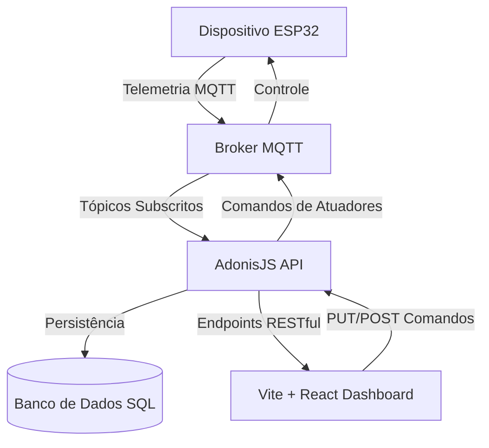

# Documentação do Sistema - Jardim de Chuva Inteligente

Esta documentação descreve o ecossistema atual do projeto **Jardim de Chuva Inteligente** (IoT), detalhando as implementações de front-end realizadas, a pilha de tecnologia utilizada, a integração com o back-end e as recomendações para os próximos passos de desenvolvimento.

---

## 1. Visão Geral do Sistema

O sistema **Jardim de Chuva Inteligente** tem como objetivo o monitoramento em tempo real e o controle automatizado/manual de drenagem hídrica sustentável. Ele permite visualizar a telemetria enviada por sensores ambientais em campo e comandar atuadores (como bombas d'água e válvulas solenoides) para otimizar o fluxo e reaproveitamento da água urbana.

### Arquitetura de Comunicação

---

## 2. O Que Foi Desenvolvido (Entregas do Front-end)

Desenvolvemos uma interface web administrativa completa, responsiva, com visual moderno em tons de verde-sálvia e estética de glassmorfismo. As telas e funcionalidades entregues incluem:

### 📊 1. Dashboard Principal
- **Banner de Status Geral**: Resumo das operações ("Sistema operando em modo automático") e cartões rápidos de eficiência (%), quantidade de sensores ativos e atuadores acionados.
- **Grade de Telemetria (6 Sensores)**: Cards dinâmicos com badges de status, barras de progresso e fallbacks automáticos:
  1. *Umidade do Solo (Capacitivo)*: Status do solo (ex: Saturado/Seco/Ótimo).
  2. *Chuva (Pluviômetro)*: Intensidade de precipitação em mm/h.
  3. *Nível de Água (Ultrassônico)*: Percentual de preenchimento do reservatório.
  4. *Luminosidade (BH1750)*: Estado diurno/noturno em klx.
  5. *Temperatura (DHT22)*: Temperatura ambiente em °C.
  6. *Umidade do Ar (DHT22)*: Umidade relativa do ar em %.
- **Gráficos de Tendências (Recharts)**: Painel interativo com abas para visualizar o histórico de 24 horas de chuva, temperatura/umidade e umidade do solo.
- **Painel de Controle de Atuadores**: Switches (toggles) liga/desliga integrados diretamente com comandos da API.

### 🔌 2. Gerenciador de Sensores
- Listagem detalhada de todos os sensores cadastrados na API.
- Exibição de metadados como: Tópico MQTT de leitura associado, última leitura recebida e localização no canteiro.
- Formulário interativo para cadastro de novos sensores (POST `/sensores`).

### ⚙️ 3. Gerenciador de Atuadores
- Painel para controle individualizado dos atuadores instalados.
- Integração em tempo real com as chamadas de API (`PUT /atuadores/:id`) para comutação de estado.
- Mapeamento de tópicos de comandos MQTT.

### 📜 4. Histórico de Leituras & Simulador IoT
- Tabela contendo todos os registros de telemetria cadastrados no banco de dados, com filtros por sensores específicos e limites de paginação.
- **Simulador de Telemetria Integrado**: Permite que desenvolvedores/usuários submetam leituras artificiais de chuva (mm, chovendo/seco) e clima (umidade, temperatura) diretamente pela interface para testar a comunicação de ponta a ponta sem precisar de um ESP32 físico ativo.

### 🔔 5. Central de Alertas e Notificações
- Exibição de alertas emitidos pelo sistema (Nível de Risco: Alto/Crítico, Aviso/Médio, Informação/Baixo).
- Ações para remover/arquivar notificações (DELETE `/alertas/:id`).
- Gerador manual de alertas para fins de homologação.

---

## 3. Tecnologias Utilizadas

A pilha de tecnologia do front-end foi selecionada para garantir máxima performance, responsividade e modularidade:

| Tecnologia | Descrição / Versão | Função no Sistema |
| :--- | :--- | :--- |
| **React** | `v19.2.6` | Biblioteca core para renderização e gerenciamento de estado. |
| **Vite** | `v5.4.11` | Ferramenta de build rápida (Downgraded para compatibilidade com Node 18). |
| **React Router Dom** | `v7.15.1` | Gerenciamento de rotas e navegação SPA. |
| **Recharts** | `v3.8.1` | Biblioteca de gráficos responsivos baseada em SVG. |
| **Lucide React** | `v0.x` | Biblioteca de ícones vetoriais modernos e leves. |
| **React Toastify** | `v11.1.0` | Sistema de notificações flutuantes (Toasts) para feedback do usuário. |
| **Axios** | `v1.16.1` | Cliente HTTP para chamadas REST à API do AdonisJS. |
| **React Is** | `v18.x` | Helper interno para compatibilidade de tipos do Recharts. |

---

## 4. Próximos Passos Recomendados

Para a evolução e finalização da implantação do sistema, sugerimos as seguintes etapas:

### 📅 Fase 1: Homologação e Testes de Campo
1. **Popular Sensores e Atuadores**: Cadastrar os sensores e atuadores físicos no banco de dados através dos formulários da aplicação web ou rodando migrations de seeders no AdonisJS.
2. **Homologar Endpoints de Controle**: Validar se as chamadas de alteração de atuador (switches de toggle) disparam as mensagens corretas no Broker MQTT (utilizando ferramentas como MQTT Explorer).

### ⚡ Fase 2: Regras de Negócio e Automação no Back-end
1. **Configurar Automações (Triggers)**: Desenvolver no back-end (AdonisJS) o processador de regras de automação cadastrados no endpoint `/automacoes`. Ex: Se sensor de umidade do solo < 40%, enviar comando de "LIGAR" para a válvula de irrigação correspondente.
2. **Integração Real ESP32**: Finalizar a conexão do firmware do ESP32 para subscrever-se nos tópicos de comando de atuadores e publicar nos tópicos de leitura dos sensores.

### 🌐 Fase 3: Implantação e Produção
1. **Variáveis de Ambiente**: Definir as chaves do arquivo `.env` de produção, especificando a URL pública da API na variável `VITE_API_URL`.
2. **Build de Produção**: Executar o comando `npm run build` para gerar a pasta `dist` com os arquivos HTML/CSS/JS minificados para hospedagem (Nginx, Vercel ou Apache).
